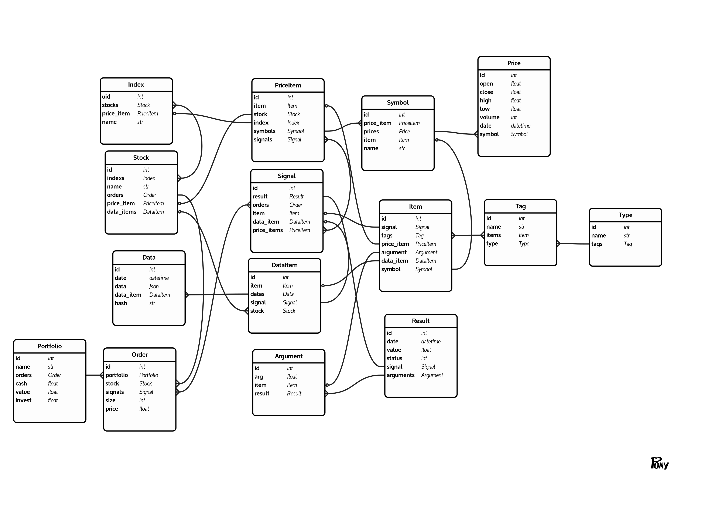

# pystockdb


[](https://travis-ci.org/portfolioplus/pystockdb)

[](https://coveralls.io/github/portfolioplus/pystockdb?branch=master)
[](https://www.codacy.com/gh/portfolioplus/pystockdb/dashboard?utm_source=github.com&amp;utm_medium=referral&amp;utm_content=portfolioplus/pystockdb&amp;utm_campaign=Badge_Grade)

Database for stocks based on [pony.orm](https://github.com/ponyorm/pony).
This package provides an create, sync and update tool.

At the moment we are only support a few stocks.
If you want to have more, please contribute [pytickersymbols](https://github.com/portfolioplus/pytickersymbols).

## install

```shell
pip install pystockdb
```

## database schema



## quick start

In all samples we use sqlite but you are free to use other providers.
For more information's please read [Connecting to the Database](https://docs.ponyorm.org/database.html).

Install sqlite stock db:
```python
import logging
from pystockdb.tools.create import CreateAndFillDataBase

logger = logging.getLogger('test')
config = {
    'max_history': 1,
    'indices': ['DAX'],
    'currencies': ['EUR'],
    'create': True
    'db_args': {
        'provider': 'sqlite',
        'filename': 'demo.sqlite',
        'create_db': True
    },
}
create = CreateAndFillDataBase(config, logger)
create.build()
```

Install mysql stock db:

For mysql you need an additional package:
`pip install pymysql`

```python
import logging
from pystockdb.tools.create import CreateAndFillDataBase

logger = logging.getLogger('test')
config = {
    'max_history': 1,
    'indices': ['DAX'],
    'currencies': ['EUR'],
    'create': True
    'db_args': {
        'provider': 'mysql',
        'host': '127.0.0.1',
        'user': 'root',
        'passwd': 'test',
        'db': 'test',
    },
}

create = CreateAndFillDataBase(config, logger)
create.build()
```

Update sqlite stock db:

```python
import logging
from pystockdb.tools import ALL_SYMBOLS
from pystockdb.tools.update import UpdateDataBaseStocks

logger = logging.getLogger('test')
config = {
    'symbols': [ALL_SYMBOLS],
    'prices': True,       # update prices
    'fundamentals': True, # update fundamental stock data
    'db_args': {
        'provider': 'sqlite',
        'filename': 'demo.sqlite',
        'create_db': False
    },
}
update = UpdateDataBaseStocks(config, logger)
update.build()
```

Sync sqlite stock db:

```python
import logging
from pystockdb.tools.sync import SyncDataBaseStocks

logger = logging.getLogger('test')
config = {
    'max_history': 1,
    'indices': ['CAC 40'], # add new index to existing database
    'currencies': ['EUR'],
    'db_args': {
        'provider': 'sqlite',
        'filename': 'demo.sqlite',
    },
}
sync = SyncDataBaseStocks(config, logger)
sync.build()
```

Getting database objects:

```python
import datetime
from pony.orm import db_session

from pystockdb.db.schema.stocks import Price, Stock
from pystockdb.tools.base import DBBase

# connect to database

arguments = {
    'db_args': {
    'provider': 'sqlite',
    'filename': 'test.sqlite',
    'create_db': False
    }
}
# Read https://docs.ponyorm.org/api_reference.html for other provider settings

DBBase(arguments, None)

now = datetime.datetime.now()
last_week = now - datetime.timedelta(days=7)
with db_session:
    # get ifx stock object
    stock = Stock.select(
        (lambda s: 'IFX.F' in s.price_item.symbols.name)
    ).first()
    # select ifx.f prices of the last week
    prices = Price.select(
        lambda p: p.symbol.name == 'IFX.F'
        and p.date >= last_week
        and p.date <= now
    )

```

## issue tracker

[https://github.com/portfolioplus/pystockdb/issuese](https://github.com/portfolioplus/pystockdb/issues")
